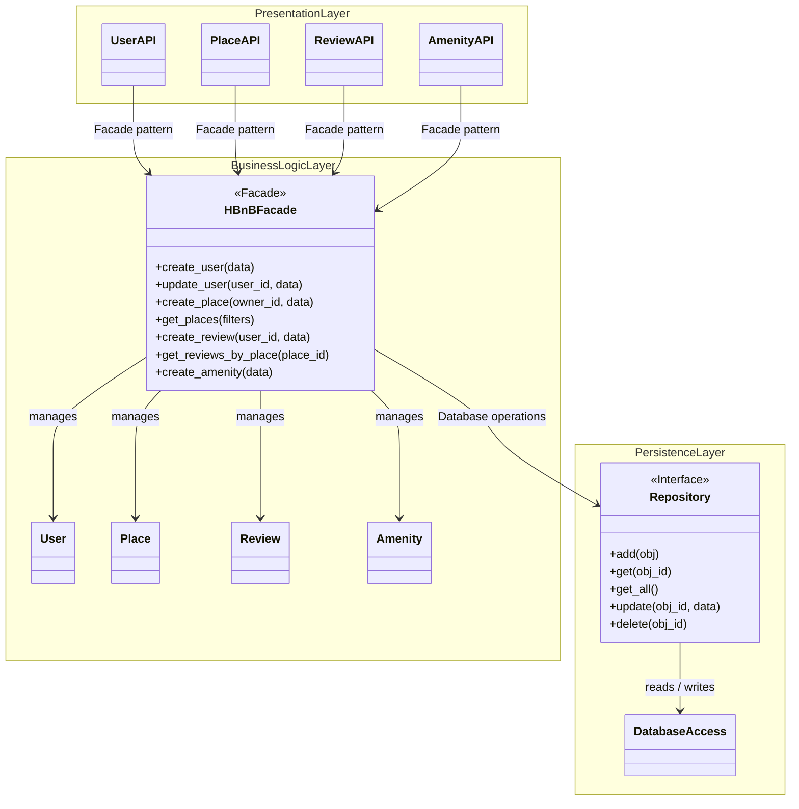
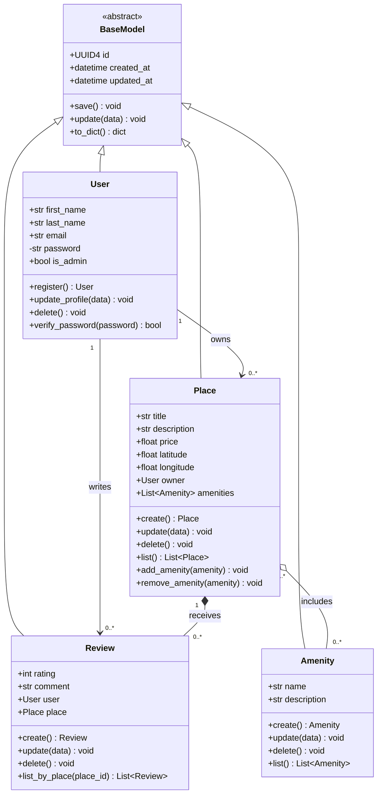
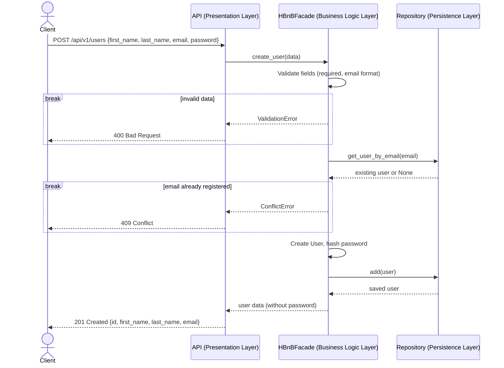
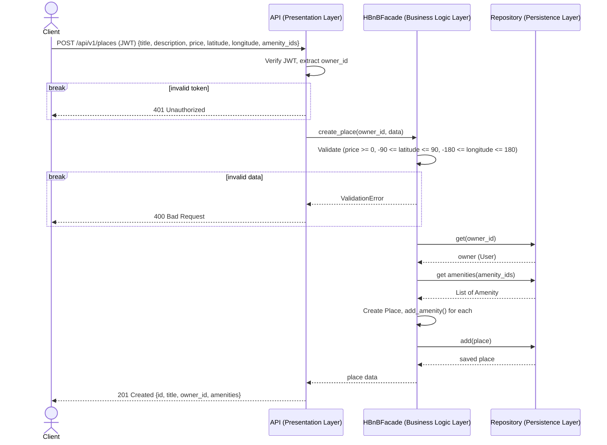
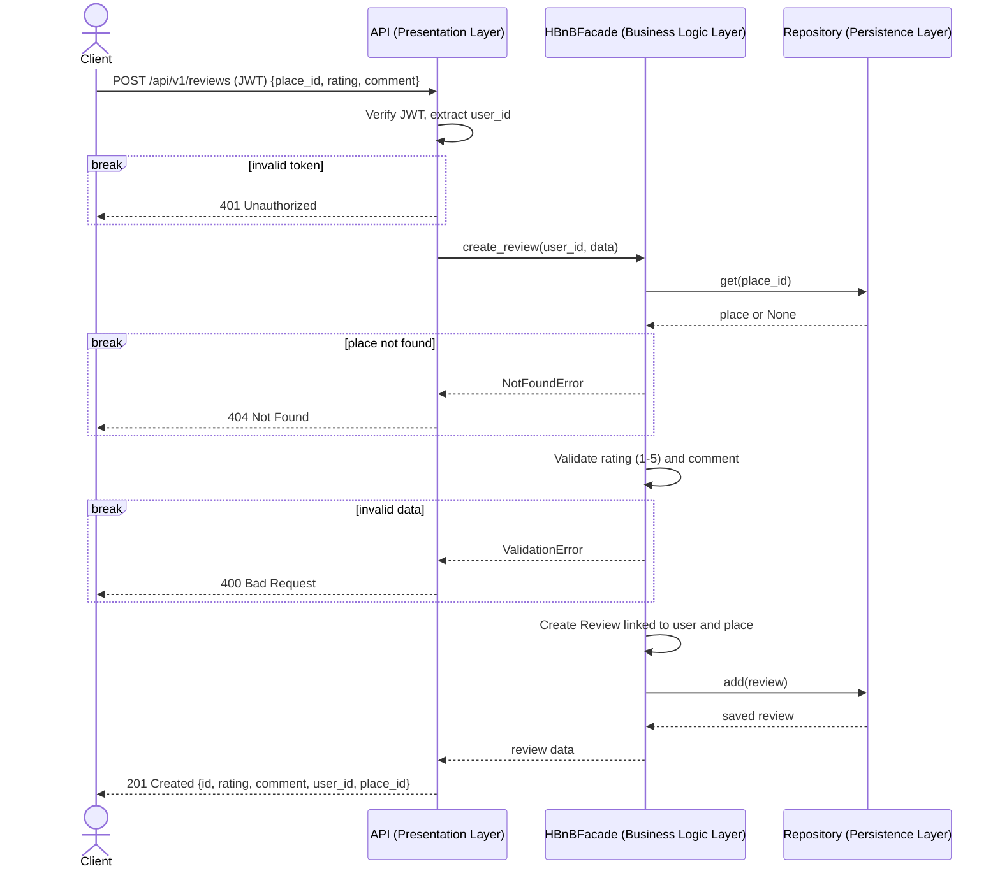
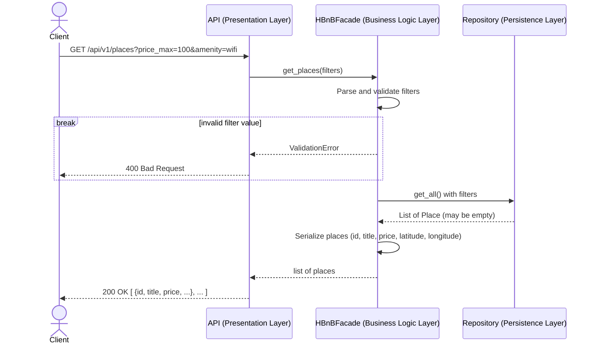

# HBnB Evolution — Technical Documentation

**Part 1: Design & Documentation**

---

## Introduction

HBnB Evolution is a simplified Airbnb-like application. Users can register and manage their profiles, list places they own, attach amenities to those places, and leave reviews on places they have visited.

This document is the technical blueprint for the project. It is written before any code, so the implementation phases (Parts 2 and 3) can be built from a clear, agreed design.

It contains:

1. **High-Level Architecture**: the three-layer package diagram and the Facade pattern that connects the layers.
2. **Business Logic Layer**: a detailed class diagram of the four core entities (User, Place, Review, Amenity) and their relationships.
3. **API Interaction Flow**: sequence diagrams for four API calls: user registration, place creation, review submission, and fetching a list of places.

All diagrams use UML notation and are written in [Mermaid](https://mermaid.js.org/), so they render directly on GitHub and stay under version control. The standalone sources are in [diagrams.md](diagrams.md).

---

## 1. High-Level Architecture

### 1.1 Package Diagram

### 1.2 Layer Responsibilities

**Presentation Layer (Services, API)**
The entry point for users. It receives HTTP requests, checks the request format, and turns results into JSON responses with the right status codes. It contains no business rules. Every operation is delegated to the `HBnBFacade`.

- `UserAPI`: register users, read and update profiles
- `PlaceAPI`: create, read, update, delete and list places
- `ReviewAPI`: create, update, delete reviews and list them by place
- `AmenityAPI`: create, update, delete and list amenities

**Business Logic Layer (Models)**
The core of the application. It holds the domain models (`User`, `Place`, `Review`, `Amenity`) and enforces the business rules: required fields, value ranges, and the existence of related objects. The `HBnBFacade` is the single public entry point of this layer.

**Persistence Layer**
Stores and retrieves data. The Business Logic layer only talks to it through the `Repository` interface (`add`, `get`, `get_all`, `update`, `delete`). The concrete database is chosen in Part 3. Because the rest of the application depends only on the interface, the storage can be swapped (for example, from in-memory to a SQL database) without changing the layers above.

### 1.3 The Facade Pattern

A facade is one simplified interface placed in front of a more complex subsystem. In HBnB, `HBnBFacade` is that interface for the Business Logic layer:

- The API calls one method, such as `create_place(owner_id, data)`. It does not need to know which models are created, which rules are checked, or which repositories are used.
- The facade coordinates the work. It creates and validates the models, then saves them through the repositories.

Benefits:

- **Loose coupling**: the API depends on one stable interface, not on every model.
- **Easier changes**: business logic can be refactored without touching the API.
- **Easier testing**: each layer can be tested in isolation by mocking the layer below it.

---

## 2. Business Logic Layer

### 2.1 Class Diagram

### 2.2 BaseModel

`BaseModel` is an abstract class that every entity inherits from. It provides what all entities need:

| Attribute    | Type     | Description                                    |
| ------------ | -------- | ---------------------------------------------- |
| `id`         | UUID4    | Unique identifier, generated on creation       |
| `created_at` | datetime | Set once, when the object is created           |
| `updated_at` | datetime | Refreshed every time the object is modified    |

Methods: `save()` refreshes `updated_at`, `update(data)` changes several attributes at once, and `to_dict()` serializes the object for the API.

Putting identity and audit timestamps in one base class means every entity follows the same rules and the code is not repeated.

### 2.3 Entities

**User**
A person registered in the system. The `is_admin` flag separates administrators from regular users. The password is private (`-`) and is stored as a hash, never in plain text.

| Key attributes | `first_name`, `last_name`, `email`, `password`, `is_admin`                 |
| -------------- | -------------------------------------------------------------------------- |
| Key methods    | `register()`, `update_profile()`, `delete()`, `verify_password()`          |
| Relationships  | Owns 0..* Places, writes 0..* Reviews                                      |

**Place**
A property listed by a user. It stores a title, description, price, and location (latitude and longitude). It keeps a reference to its owner and a list of its amenities.

| Key attributes | `title`, `description`, `price`, `latitude`, `longitude`, `owner`, `amenities`                     |
| -------------- | -------------------------------------------------------------------------------------------------- |
| Key methods    | `create()`, `update()`, `delete()`, `list()`, `add_amenity()`, `remove_amenity()`                  |
| Relationships  | Belongs to 1 User (owner), receives 0..* Reviews, includes 0..* Amenities                           |
| Rules          | `price` ≥ 0; `latitude` between -90 and 90; `longitude` between -180 and 180                      |

**Review**
A rating and comment left by a user about a place.

| Key attributes | `rating`, `comment`, `user`, `place`                               |
| -------------- | ------------------------------------------------------------------ |
| Key methods    | `create()`, `update()`, `delete()`, `list_by_place()`              |
| Relationships  | Written by 1 User, belongs to 1 Place                              |
| Rules          | `rating` is an integer from 1 to 5; the user and place must exist  |

**Amenity**
A feature a place can offer, such as Wi-Fi, a pool, or parking. Amenities are managed on their own and then attached to places.

| Key attributes | `name`, `description`                              |
| -------------- | -------------------------------------------------- |
| Key methods    | `create()`, `update()`, `delete()`, `list()`       |
| Relationships  | Included in 0..* Places                            |

### 2.4 Relationships

| Relationship       | UML type                     | Multiplicity | Meaning                                                                                                  |
| ------------------ | ---------------------------- | ------------ | -------------------------------------------------------------------------------------------------------- |
| Entity → BaseModel | Generalization (inheritance) | n/a          | Every entity gets `id`, `created_at`, `updated_at`                                                        |
| User → Place       | Association                  | 1 to 0..*    | A user can own many places; each place has exactly one owner                                             |
| User → Review      | Association                  | 1 to 0..*    | A user can write many reviews; each review has exactly one author                                        |
| Place → Review     | Composition                  | 1 to 0..*    | A review cannot exist without its place; deleting a place deletes its reviews                            |
| Place ↔ Amenity    | Aggregation                  | 0..* to 0..* | A place can have many amenities, and one amenity can be shared by many places. Amenities outlive places |

---

## 3. API Interaction Flow

All four diagrams use the same participants, one per layer:

| Participant  | Layer          | Role                                                     |
| ------------ | -------------- | -------------------------------------------------------- |
| Client       | n/a            | The user or application that sends the request          |
| API          | Presentation   | Receives the HTTP request and returns the HTTP response  |
| HBnBFacade   | Business Logic | Validates data, applies rules, creates models            |
| Repository   | Persistence    | Saves and retrieves objects                               |

Solid arrows are requests, dashed arrows are responses. A `break` block shows an error case that stops the flow and returns early.

### 3.1 User Registration

**Endpoint:** `POST /api/v1/users`

1. The client sends the new user's details.
2. The API passes them to the facade with `create_user(data)`.
3. The facade checks that the required fields are present and the email is valid. If not, the client gets `400 Bad Request`.
4. The facade asks the repository whether the email is already used. If it is, the client gets `409 Conflict`.
5. The facade creates the `User`, hashes the password, and saves it.
6. The API returns `201 Created` with the new user, without the password.

**Design decision:** the email uniqueness check lives in the Business Logic layer, so the rule applies to every caller of the facade, not just one endpoint.

### 3.2 Place Creation

**Endpoint:** `POST /api/v1/places`

1. The client sends the place details and an authentication token.
2. The API verifies the token and gets the owner's ID from it. An invalid token returns `401 Unauthorized`.
3. The facade validates the price and coordinates. Invalid values return `400 Bad Request`.
4. The facade loads the owner and the requested amenities, creates the `Place`, and attaches each amenity with `add_amenity()`.
5. The place is saved and the API returns `201 Created`.

**Design decision:** the owner comes from the authenticated user, not from the request body, so a user cannot create a place in someone else's name.

### 3.3 Review Submission

**Endpoint:** `POST /api/v1/reviews`

1. The client sends the place ID, a rating, and a comment, with an authentication token.
2. The API verifies the token. An invalid token returns `401 Unauthorized`.
3. The facade checks that the place exists. If not, the client gets `404 Not Found`.
4. The facade checks that the rating is between 1 and 5 and the comment is not empty. If not, the client gets `400 Bad Request`.
5. The facade creates the `Review`, linked to the user and the place, and saves it.
6. The API returns `201 Created`.

**Design decision:** the review is linked to both the user and the place, so reviews can later be listed by place (`list_by_place`), as the business rules require.

### 3.4 Fetching a List of Places

**Endpoint:** `GET /api/v1/places`

1. The client asks for places, optionally with filters such as a maximum price or an amenity.
2. The facade checks the filter values. An invalid value, such as a negative price, returns `400 Bad Request`.
3. The repository returns the matching places.
4. The facade turns them into simple dictionaries, and the API returns `200 OK` with the list.

**Design decision:** an empty result returns `200 OK` with an empty list, not `404 Not Found`. "No places match" is a valid answer, not an error.

---

## 4. Summary of Design Decisions

| Decision                         | Rationale                                                                                   |
| -------------------------------- | ------------------------------------------------------------------------------------------- |
| Three-layer architecture         | Separation of concerns; each layer can be tested and changed on its own                     |
| Facade between layers            | The API depends on one stable interface instead of on every model                           |
| `BaseModel` with UUID4 and dates | Every entity is uniquely identified and audited in the same way                             |
| Validation in Business Logic     | Rules are enforced in one place, whatever client calls the API                              |
| Repository interface             | The database can be chosen in Part 3 and changed later without touching the business logic  |
| Composition Place → Review       | A review has no meaning without its place                                                   |
| Aggregation Place ↔ Amenity      | Amenities are shared between places and exist independently                                 |

---

_HBnB Evolution, Part 1: Technical Documentation_
