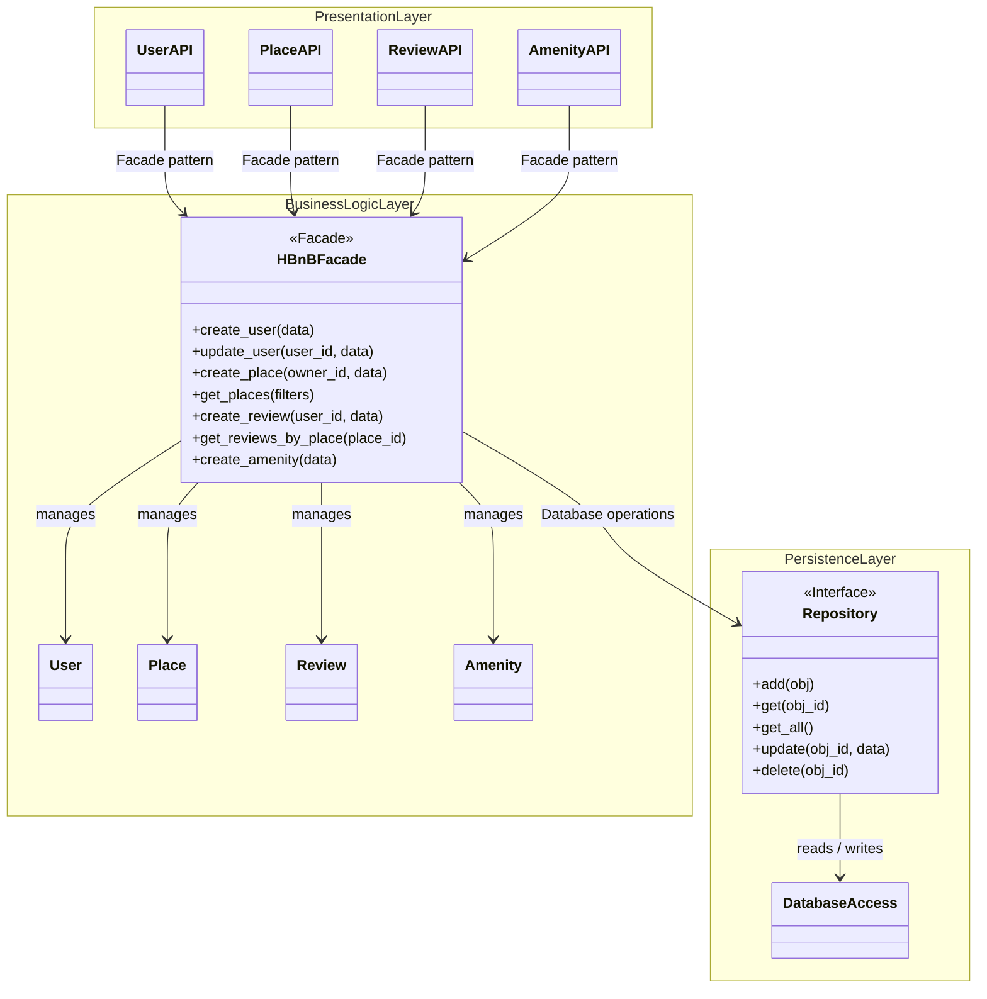
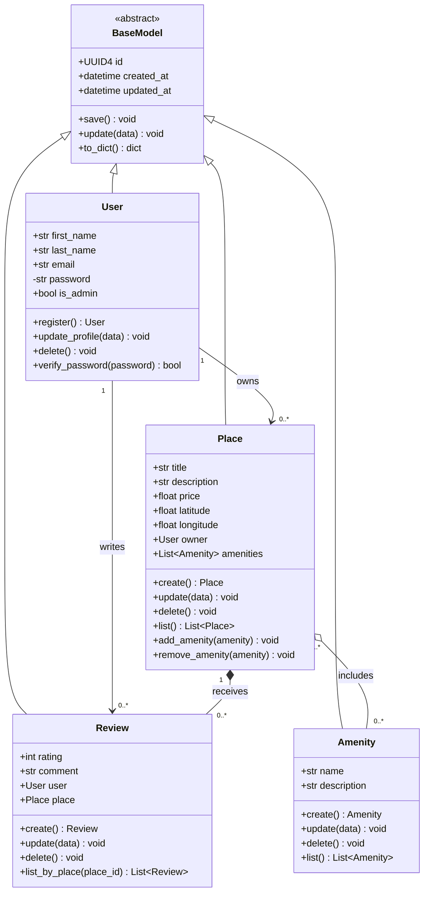
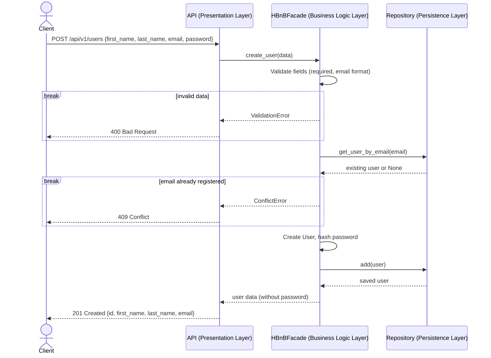
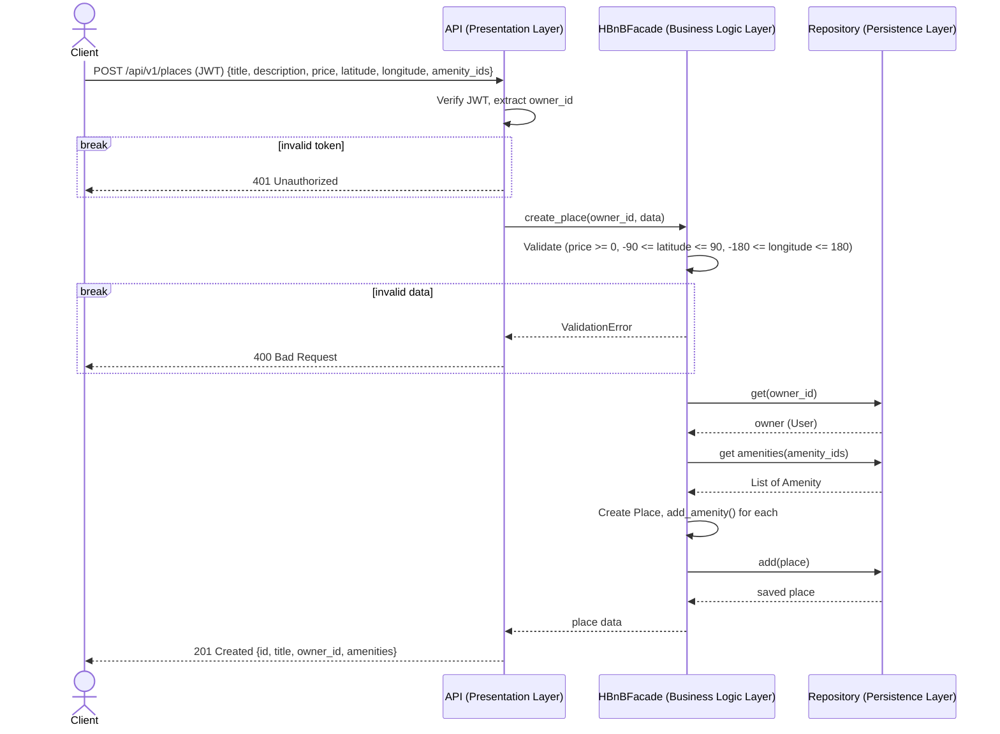
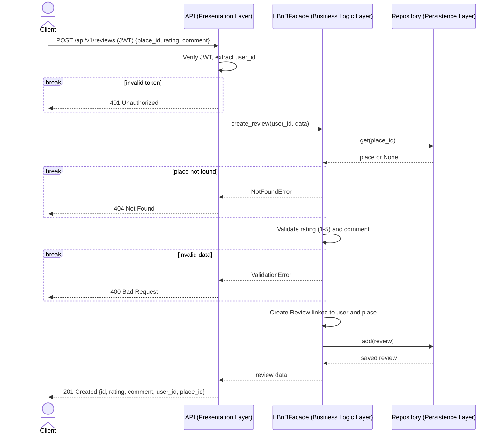
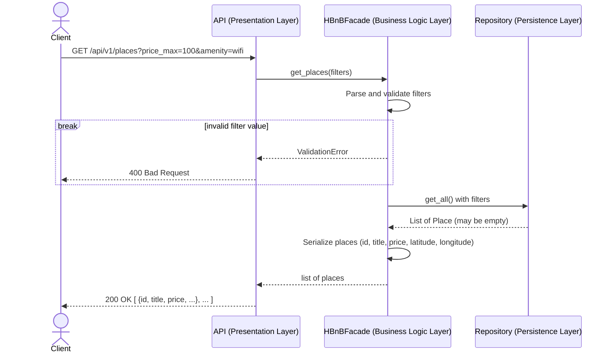

# HBnB Diagrams — Mermaid Source

Copy any block below into https://mermaid.live to render or edit. GitHub renders these blocks automatically.

---

## Diagram 1: High-Level Package Diagram

---

## Diagram 2: Business Logic Class Diagram

---

## Diagram 3a: User Registration

---

## Diagram 3b: Place Creation

---

## Diagram 3c: Review Submission

---

## Diagram 3d: Fetching a List of Places

