# HBnB — Entity-Relationship Diagram

This diagram shows the database schema created by the SQLAlchemy models and by [`sql/schema.sql`](sql/schema.sql). GitHub renders it automatically. It can also be edited at https://mermaid.live.

```mermaid
erDiagram
    USERS {
        CHAR(36) id PK
        VARCHAR(50) first_name
        VARCHAR(50) last_name
        VARCHAR(120) email UK
        VARCHAR(128) password "bcrypt hash"
        BOOLEAN is_admin
        DATETIME created_at
        DATETIME updated_at
    }

    PLACES {
        CHAR(36) id PK
        VARCHAR(100) title
        TEXT description
        FLOAT price "> 0"
        FLOAT latitude "-90 to 90"
        FLOAT longitude "-180 to 180"
        CHAR(36) owner_id FK
        DATETIME created_at
        DATETIME updated_at
    }

    REVIEWS {
        CHAR(36) id PK
        TEXT text
        INT rating "1 to 5"
        CHAR(36) user_id FK "unique with place_id"
        CHAR(36) place_id FK "unique with user_id"
        DATETIME created_at
        DATETIME updated_at
    }

    AMENITIES {
        CHAR(36) id PK
        VARCHAR(50) name UK
        VARCHAR(255) description
        DATETIME created_at
        DATETIME updated_at
    }

    PLACE_AMENITY {
        CHAR(36) place_id PK, FK
        CHAR(36) amenity_id PK, FK
    }

    USERS ||--o{ PLACES : owns
    USERS ||--o{ REVIEWS : writes
    PLACES ||--o{ REVIEWS : receives
    PLACES ||--o{ PLACE_AMENITY : has
    AMENITIES ||--o{ PLACE_AMENITY : "is linked to"
```

## Relationships

| Relationship          | Type         | Foreign key                                  | Meaning                                                                 |
| --------------------- | ------------ | -------------------------------------------- | ----------------------------------------------------------------------- |
| User → Place          | One-to-many  | `places.owner_id` → `users.id`               | A user owns zero or more places; each place has exactly one owner       |
| User → Review         | One-to-many  | `reviews.user_id` → `users.id`               | A user writes zero or more reviews; each review has exactly one author  |
| Place → Review        | One-to-many  | `reviews.place_id` → `places.id`             | A place receives zero or more reviews; deleting a place deletes them    |
| Place ↔ Amenity       | Many-to-many | `place_amenity.place_id`, `place_amenity.amenity_id` | A place has many amenities, and an amenity belongs to many places |

## Constraints

- `users.email` and `amenities.name` are unique.
- `(reviews.user_id, reviews.place_id)` is unique: a user reviews a place only once.
- `place_amenity` uses the pair `(place_id, amenity_id)` as its primary key, so the same link cannot be stored twice.
- `CHECK` constraints in `schema.sql` enforce the rating, price, and coordinate ranges, matching the model validation.
